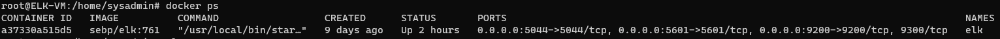

## Automated ELK Stack Deployment

The files in this repository were used to configure the network depicted below.

These files have been tested and used to generate a live ELK deployment on Azure. They can be used to either recreate the entire deployment pictured above. Alternatively, select portions of the playbook file may be used to install only certain pieces of it, such as Filebeat.

  - Ansible/deploy_dvwa.yml
  - Ansible/deploy_elk.yml
  - Ansible/filebeat-playbook.yml
  - Ansible/metricbeat-playbook.yml

This document contains the following details:
- Description of the Topology
- Access Policies
- ELK Configuration
  - Beats in Use
  - Machines Being Monitored
- How to Use the Ansible Build

### Description of the Topology

The main purpose of this network is to expose a load-balanced and monitored instance of DVWA, the Damn Vulnerable Web Application.

Load balancing ensures that the application will be highly available, in addition to restricting access to the network.
- Load balancers protect availability of a network. The Jumpbox provides a separate access point to the network. From the Jumpbox, Ansible can be used to deploy docker containers. 

Integrating an ELK server allows users to easily monitor the vulnerable VMs for changes to the logs and file system.
- Filebeat is a lightweight shipper for forwarding and centralizing log data. Installed as an agent on your servers, Filebeat monitors the log files or locations that you specify, collects log events, and forwards them either to Elasticsearch or Logstash for indexing.
- Metricbeat takes the metrics and statistics that it collects and ships them to the output that you specify, such as Elasticsearch or Logstash.

The configuration details of each machine may be found below.

| Name          | Function |Public IP   |Private IP| Operating System |
|---------------|----------|------------|----------|------------------|
| ELK-VM        | VM       |13.67.188.48| 10.1.0.4 |       Linux      |
| Jump Box      | Gateway  |20.127.66.20| 10.0.0.4 |       Linux      |
| Load Balancer | Gateway  |168.62.53.35|          |       Linux      |
| Web-1         | VM       |          ↪ | 10.0.0.5 |       Linux      |
| Web-2         | VM       |          ↪ | 10.0.0.6 |       Linux      |

### Access Policies

Web-1 and Web-2 on the internal network are not exposed to the public Internet. 

Only the Jumpbox machine can accept ssh connections from my home workstation using ssh-keys. Access to this machine is only allowed from the following IP addresses:
- Home workstation @ 184.xxx.xxx.xxx port 22

Machines within the network can only be accessed through the Ansible container on the Jumpbox.
- ELK interface can be accessed from Home workstation @ 184.xxx.xxx.xxx via HTTP through port 5601

A summary of the access policies in place can be found in the table below.

| Name         | Publicly Accessible | Allowed Inbound IP Addresses  |
|--------------|---------------------|-------------------------------|
| Jump Box     |         Yes         | 184.xxx.xxx.xxx SSH  port 22  |
| Load Balancer|         Yes         | 184.xxx.xxx.xxx HTTP port 80  |
| ELK Interface|         Yes         | 184.xxx.xxx.xxx HTTP port 5601|
| Web-1        |         No          | 10.0.0.4        SSH  port 22  |
| Web-2        |         No          | 10.0.0.4        SSH  port 22  |

### Elk Configuration

Ansible was used to automate configuration of the ELK machine. No configuration was performed manually, which is advantageous because...
- Containers can be deployed to multiple machines by setting up a single configuration file and playbook.

The playbook implements the following tasks:
- Installs docker.io
- Installs python3-pip
- Install docker module using pip
- Increase virtual memory using systemctl
- Download and Launch Docker ELK container / Enable ELK ports - 5601, 9200, 5044
- Enable the docker container to start up on boot using systemd.

The following screenshot displays the result of running `docker ps` after successfully configuring the ELK instance.

### Target Machines & Beats
This ELK server is configured to monitor the following machines:
- 10.0.0.5 (WEB-1)
- 10.0.0.6 (WEB-2)

We have installed the following Beats on these machines:
- Filebeat
- Metricbeat

These Beats allow us to collect the following information from each machine:
- Filebeat monitors the log files or locations that the user specifies, collects log events.
- Metricbeat takes the metrics and statistics that it collects and ships them to the output that you specify, such as Elasticsearch or Logstash.

### Using the Playbook
In order to use the playbook, you will need to have an Ansible control node already configured. Assuming you have such a control node provisioned: 

<pre>
|-- ./ansible.cfg 
|-- ./deploy_dvwa.yml 
|-- ./deploy_elk.yml 
|-- ./filebeat-playbook.yml 
|-- ./hosts 
|-- ./metricbeat-playbook.yml 
|-- ./files 
    |-- ./files/filebeat-config.yml 
    `-- ./files/metricbeat-config.yml
</pre>

SSH into the control node and follow the steps below:

- Copy the filebeat and Metricbeat config files to the files folder.
- Update the ansible host file to include the private IPs ot WEB-1, WEB-2 and the ELK VM
>[webservers]
10.0.0.5 ansible_python_interpreter=/usr/bin/python3
10.0.0.6 ansible_python_interpreter=/usr/bin/python3
[elk]
10.1.0.4 ansible_python_interpreter=/usr/bin/python3

- Run the playbook, and navigate to ____ to check that the installation worked as expected.

_TODO: Answer the following questions to fill in the blanks:_
- _Which file is the playbook? Where do you copy it?_
- _Which file do you update to make Ansible run the playbook on a specific machine? How do I specify which machine to install the ELK server on versus which to install Filebeat on?_
- _Which URL do you navigate to in order to check that the ELK server is running?

_As a **Bonus**, provide the specific commands the user will need to run to download the playbook, update the files, etc._